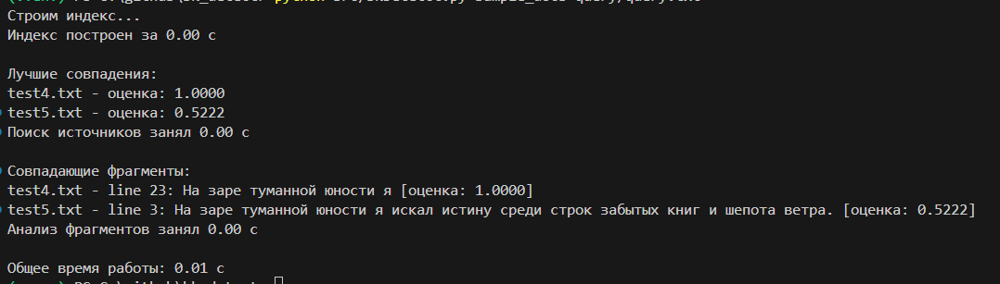

## bkdetect



`bkdetect` — инструмент, упрощающий поиск документов‑источников и совпадающих фрагментов текста. Проект ориентирован на проверку заимствований, поиск первоисточников и быстрый аудит текстовых коллекций.

---

### Основные возможности
- **Поддержка форматов:** `.txt`, `.csv`, `.docx`, `.html/.htm` с построчной или попараграфной индексацией.  
- **Нормализация текста:** очистка от HTML, приведение к нижнему регистру, фильтрация стоп-слов (NLTK), стемминг для русского и английского языков.  
- **Индексирование:** построение компактного TF-IDF-подобного индекса на базе `HashingVectorizer` из scikit-learn и инкрементальное добавление документов.  
- **Поиск совпадений:** определение наиболее схожих документов и выделение конкретных строк/параграфов, в которых встречаются токены запроса.  
- **CLI на русском языке:** детальные сообщения о ходе работы и времени выполнения операций.  
- **Пакет на PyPI:** можно установить одной командой и использовать как библиотеку.

---

### Установка

#### Из PyPI
```bash
pip install bkdetect
```

#### Из исходников репозитория
```bash
git clone https://github.com/your-org/bk_detect.git
cd bk_detect
python -m venv .venv
.\.venv\Scripts\activate        # Windows
# source .venv/bin/activate     # Linux/macOS
pip install -r requirements.txt
pip install .
```

---

### Быстрый старт (CLI)
```bash
bk-detect sample_docs query/query.txt
```

Пример вывода:
```
Строим индекс...
Индекс построен за 1.42 с

Лучшие совпадения:
Pushkin_Kapitanskaya_dochka.docx — оценка: 0.8123
test3.txt — оценка: 0.5478

Поиск источников занял 0.38 с

Совпадающие фрагменты:
Pushkin_Kapitanskaya_dochka.docx — paragraph 42: ... [оценка: 0.8123]
test3.txt — line 15: ... [оценка: 0.5478]

Анализ фрагментов занял 0.27 с
Общее время работы: 2.07 с
```

---

### Опции командной строки

| Опция | Описание |
| --- | --- |
| `--language {ru,en}` | Язык нормализации текста (по умолчанию `ru`). |
| `--chunk-size <int>` | Размер порции документов, обрабатываемых за один проход (по умолчанию 500). |
| `--top-k <int>` | Количество выводимых документов с наибольшей схожестью (по умолчанию 5). |
| `--max-positions <int>` | Максимальное число совпадающих фрагментов на один документ. |
| `--snippet-len <int>` | Ограничение длины выводимого фрагмента. |
| `--no-stemming` | Отключить стемминг. |
| `--keep-stopwords` | Не удалять стоп-слова. |

Полный список опций можно посмотреть командой:
```bash
bk-detect --help
```

---

### Использование в Python-коде
```python
from pathlib import Path
from source_finder import SourceFinder

docs_path = Path("sample_docs")
query_text = Path("query/query.txt").read_text(encoding="utf-8")

finder = SourceFinder.from_path(docs_path, language="ru")
finder.build_index()

matches = finder.find_sources(query_text, top_k=3)
for match in matches:
    print(match.path, match.score)

positions = finder.locate_source_positions(query_text, top_k=2)
for pos in positions:
    print(pos.path, pos.label, pos.index, pos.snippet)
```

---

### Структура репозитория

| Путь | Назначение |
| --- | --- |
| `src/` | Исходный код пакета. |
| `src/bkDetetct.py` | CLI-интерфейс и точка входа. |
| `src/documents.py` | Модель документов и метаданных. |
| `src/loaders.py` | Загрузчики и разбиение файлов на чанки. |
| `src/text_pipeline.py` | Очистка и токенизация текста. |
| `src/indexing.py` | Индексирование и вычисление схожести. |
| `src/source_finder.py` | Высокоуровневый фасад для поиска. |
| `src/stemmers/` | Реализация русского портера. |
| `sample_docs/` | Пример коллекции документов. |
| `query/` | Пример файла с запросом. |
